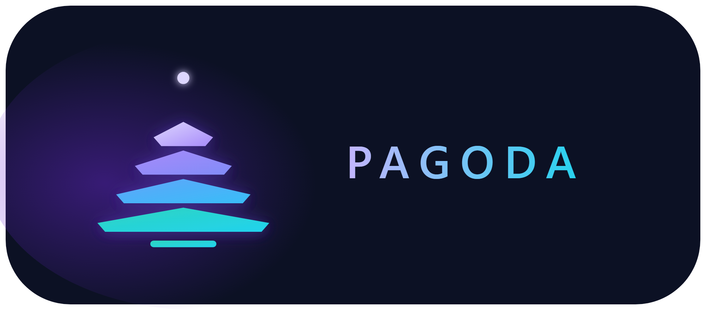

<p align="center">
  
</p>
<p align="center"><a href="https://github.com/quantz8a/pagoda/actions/workflows/ci.yml"></a> <a href="https://crates.io/crates/pagoda"></a> <a href="https://docs.rs/pagoda"></a></p>

SGLang 架构思想的 Rust 重实现：零第三方依赖的 LLM 推理服务引擎，
外加一个可插真实 HuggingFace 权重/分词器的姊妹 crate。

*A zero-dependency Rust re-implementation of SGLang-style LLM serving
(radix/APC prefix cache, paged KV, continuous batching, checkpoint branching),
plus a companion crate that plugs in real HuggingFace tokenizers and Candle
weights. Docs are primarily in Chinese.*

## 仓库结构

| 目录 | 说明 |
| --- | --- |
| [`pagoda/`](pagoda/) | 主 crate：**零依赖、离线可编译可测试**（78 项测试）。引擎、双前缀缓存（Radix/APC）、分页 KV、调度、约束解码、HTTP 服务、DSL |
| [`pagoda-hf/`](pagoda-hf/) | 姊妹 crate（需联网）：HF tokenizer + Candle 真实权重、增量 KV 会话、checkpoint KV 分叉、基准与端到端验证脚本 |

## 五分钟上手

```bash
cd pagoda
cargo test                    # 78 项测试全绿即环境 OK（离线）
cargo run --bin pagoda -- sample -p "你好" --repeat 2
cargo run --bin pagoda -- serve --port 8080
```

真实权重端到端验证（联网）：

```bash
cd pagoda-hf && bash scripts/verify-p1.sh --mirror   # 直连 HF 可去掉 --mirror
```

## 从这里开始读

- 小白文档体系（从"什么是 LLM 推理服务"讲起）：[`pagoda/docs/guide/README.md`](pagoda/docs/guide/README.md)
- 架构设计与路线图：[`pagoda/docs/DESIGN.md`](pagoda/docs/DESIGN.md)
- 与 SGLang / HF transformers 的实测对比：[`pagoda/docs/BENCHMARK.md`](pagoda/docs/BENCHMARK.md)
- 卖点与差异化：[`pagoda/docs/SELLING-POINTS.md`](pagoda/docs/SELLING-POINTS.md)

## License

[Apache-2.0](LICENSE) — 可自由使用、修改与分发，包括商用和闭源。与上游
SGLang 同属宽松开源生态，署名与血缘由 `NOTICE` 保留。
