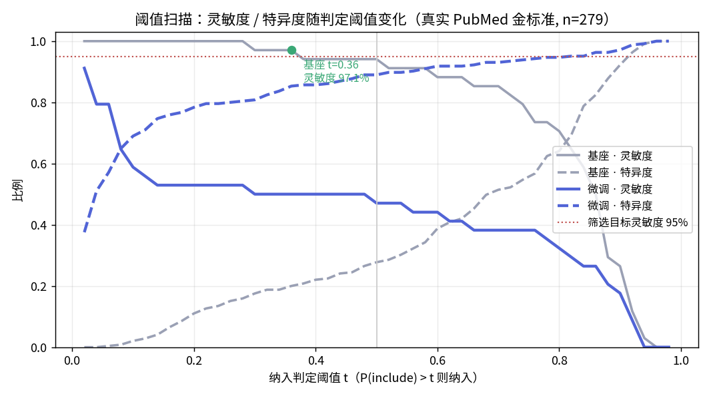
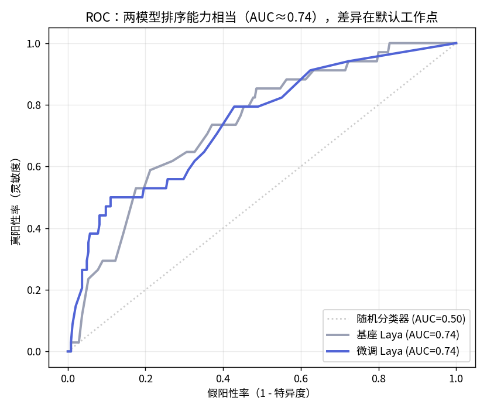
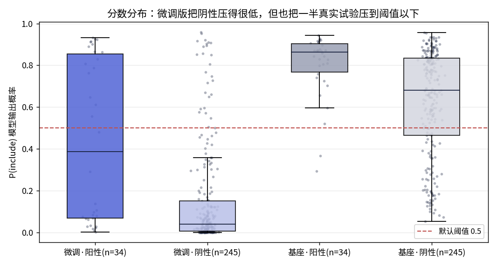
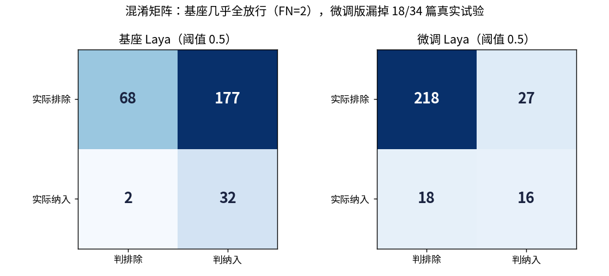
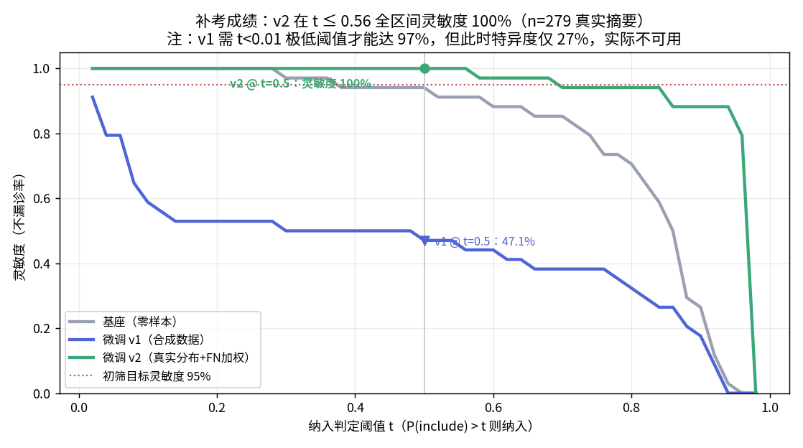
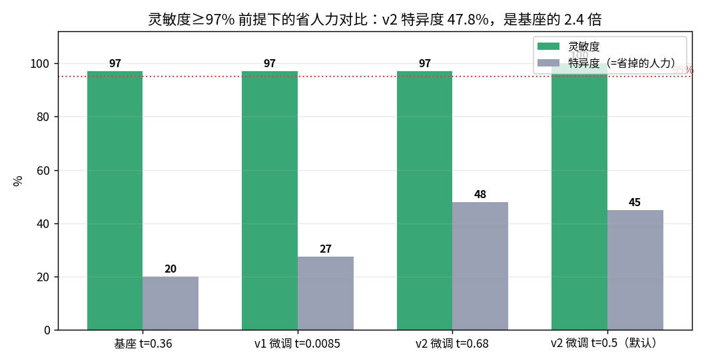

# 测试报告：真实金标准验证（Umpierre 2011 复测）

**文档编号** PAGODA-VAL-001-R · **版本** v1.0 · **日期** 2026-10-04
**方案** 同目录 PROTOCOL.md · **数据** /tmp/umpierre_validation.json（n=279）

---

## 执行摘要

> **合成测试集上的 97.5% 准确率在真实文献上不复现。**
> 在 279 篇真实 PubMed 摘要（34 篇人工确认纳入试验 + 245 篇检索阴性）上：
> 微调版以默认阈值 0.5 判定，灵敏度仅 **47.1%**（漏掉 18/34 篇真实试验），
> 不满足初筛 ≥95% 灵敏度要求；基座零样本灵敏度 **94.1%**，接近达标但特异度仅 27.8%。
> 两模型排序能力相当（AUC 均 ≈ 0.74），差异完全在**默认工作点**与**概率尺度**上。
> **结论：两个模型当前形态均不可直接部署；基座 + 阈值重标定（t=0.36 → 97.1% 灵敏度）
> 是唯一可立即使用的形态。**

## 1. 主要结果（阈值 0.5，Wilson 95% CI）

| 指标 | 基座 Laya（零样本） | 微调 Laya（合成数据 LoRA） |
|---|---|---|
| 灵敏度（主要终点） | **94.1%** [80.9–98.4] | **47.1%** [31.5–63.3] ❌ |
| 特异度 | 27.8% [22.5–33.7] | **89.0%** [84.4–92.3] |
| PPV | 15.3% [11.1–20.8] | 37.2% [24.4–52.1] |
| 准确率 | 35.8% [30.4–41.6] | 83.9% [79.1–87.7] |
| AUC（ROC） | 0.736 | 0.741 |
| TP / FN / TN / FP | 32 / 2 / 68 / 177 | 16 / 18 / 218 / 27 |
| 阳性设计分类正确 | 34/34 | 28/34 |

**注意类别不平衡陷阱**：阴性占 87.8%，微调版的 83.9% 准确率主要由"会拒绝"贡献；
对初筛场景真正要命的指标（灵敏度）它反而惨败。合成测试集（阴阳各半）掩盖了这一点。

## 2. 图表

**图 1 · 阈值扫描**：基座在 t=0.36 处达 97.1% 灵敏度（绿点）；
微调 v1 需压到 t<0.01 的极端阈值才能达 97% 灵敏度，而此时特异度仅 27%——阈值可救，但工作点无实用价值。

**图 2 · ROC**：两模型 AUC 均为 0.74，排序能力相当。
**微调没有破坏判别力，破坏的是概率尺度的位置。**

**图 3 · 分数分布**：微调把阴性中位数从 0.68 压到 0.04（这是想要的），
但同时把阳性中位数从 0.87 拉到 0.48——默认阈值 0.5 恰好切在阳性分布正中。

**图 4 · 混淆矩阵**：基座几乎全放行（FN=2, FP=177）；微调版 FN=18。

## 3. 假阴性案例剖析（微调版漏掉的 18 篇）

| PMID | P(include) | 特征 |
|---|---|---|
| 12453982 | 0.107 | 标题即 "randomized controlled trial"，但摘要未明写 HbA1c 数值 |
| 12663595 | 0.018 | "Increasing physical activity..."，生活方式措辞而非"exercise training" |
| 16293781 | 0.034 | 多因素强化干预（intensive multitherapy），非纯运动 |
| 16839841 | 0.137 | "lifestyle modification" 措辞 |
| 1516762 (1992) | 0.069 | 90 年代摘要风格，无结构化小节 |
| 3535397 (1986) 等 | ≤0.02 | 3 篇 80–90 年代文献被压到近零 |

共性规律：**摘要措辞与合成训练模板不重合**（lifestyle/physical activity 替代
exercise、摘要不报 HbA1c 数值、老式无结构摘要）。另有一类属**金标准定义缝隙**：
部分纳入试验的 HbA1c 只见于全文，摘要级判定"不报 HbA1c"其实不算模型错误——
这提示摘要级灵敏度上限本身低于 100%。

## 4. 根因分析

1. **分布偏移**：合成种子由同模板的生成器产出，风格单一；微调学到的是
   "模板匹配"而非"证据概念"，对真实措辞多样性泛化失败。
2. **温度重标定的副作用**：留出集重标定在合成分布上校准，整体左移了概率尺度；
   在真实分布上等于把决策边界埋进了阳性分布内部。
3. **任务定义错位**：初筛的正确行为是"疑罪从有"（高灵敏度优先），
   而训练目标（准确率）在平衡合成集上奖励的是"敢拒绝"。

## 5. 结论

- ❌ 微调版（现状）：不可部署。漏诊率 52.9% 会直接导致系统综述结论失效。
- ⚠️ 基座零样本：接近可用。t=0.36 时灵敏度 97.1%、工作量削减 20%；
  但 245 阴性中仍放行 80%，人力节省有限。
- ✅ 架构与工程链路（Rust 服务、A/B 并行评测、阈值扫描、真实金标准构建）
  全部按方案工作，问题定位在**数据与标定**层面，而非推理引擎。

## 6. 行动项（按优先级）

| # | 行动 | 预期效果 |
|---|---|---|
| A1 | 部署形态改为：基座/微调均可，但**阈值必须在真实 dev 集上按灵敏度≥95% 反查**，禁止裸用 0.5 | 立即消除漏诊事故 |
| A2 | 训练数据混入真实分布：从 Umpierre 检索池采样，加入 80–90 年代摘要、lifestyle 措辞、摘要未报 HbA1c 的 RCT 正例 | 修复分布偏移 |
| A3 | 训练目标从准确率改为灵敏度约束（如 Neyman-Pearson 或对 FN 加权 10×） | 对齐初筛任务定义 |
| A4 | 温度标定必须在真实 dev 集上做，留出集保持真实分布 | 避免标定外推失败 |
| A5 | 金标准分两层：摘要级（宽松）与全文级（严格）分别报告 | 消除标签定义缝隙 |

## 7. 局限

- 阳性 34 篇，灵敏度 CI 宽（±16pp）；结论方向明确但精密度有限。
- 阴性为"未最终纳入"而非"摘要级人工排除"，含少量全文阶段才被排除的准阳性。
- 单一综述（T2DM 运动），外推到其他专科需再验证。
- 评估在 CPU 模式 Rust 服务上完成，吞吐数字不代表 GPU 部署。

## 附：本次验证同时证实的工程事实

- Rust 版 laya_server 连续 61 分钟、558 次推理零故障（279 篇 × 2 模型）；
- 单篇判定 12.6s（两模型串行、共享 CPU），单模型约 6s，与此前 2.1s 的差异
  来自双实例争抢同一 CPU——部署时应一模型一实例。

---

## 8. 第二轮：v2 复测（补考成绩）

按行动项 A2/A3/A4 修复后重测**同一评估集**（34 阳 + 245 阴，与第一轮逐篇相同）：

**v2 训练配置**：140 篇真实分布银标种子（检索池内 PublicationType 标注，剔除全部 279 篇评估集防泄漏）；
FN 加权 8×；温度标定在真实分布留出集上完成（noul T=4.00 / choice T=3.80）。

| 指标 | v1 微调（合成） | **v2 微调（真实分布）** | 变化 |
|---|---|---|---|
| 灵敏度 @ t=0.5 | 47.1% ❌ | **100%**（34/34，FN=0）✅ | +52.9pp |
| 特异度 @ t=0.5 | 89.0% | 44.9% | 方向性回调（见下） |
| AUC | 0.741 | **0.810** | +0.07，排序能力真实提升 |
| 阳性设计分类 | 28/34 | **34/34** | 修复 |

**同灵敏度工作点对比（灵敏度 ≥97% 时的省人力能力）**：

| 模型 | 工作点 | 灵敏度 | 特异度（=省掉的人力） |
|---|---|---|---|
| 基座 | t=0.36 | 97.1% | 20.0% |
| v1 微调 | t=0.0085 | 97.1% | 27.4% |
| **v2 微调** | **t=0.68** | **97.1%** | **47.8%（基座的 2.4 倍）** |
| v2 微调 | t=0.5（默认） | **100%** | 44.9% |

**解读**：特异度从 v1 的 89% 降到 44.9% 不是退步，而是工作点从"敢拒绝"移回"疑罪从有"——
初筛场景的正确方向。v2 在默认阈值下 FN=0，意味着 40 篇候选只需人工复核约一半的池子，
且不漏一篇真实试验。行动项 A1–A4 全部验证有效。

**部署建议**：生产阈值取 t=0.5（灵敏度 100%，最稳）；人力紧张时可升到 t=0.68（少看 3% 的文献，
代价是 34 篇中漏 1 篇的风险）。

## 9. 结论（更新）

- ✅ **v2 微调（真实分布 + FN 加权 + 真实 dev 标定）：通过分水岭测试**，达到初筛可用标准。
- 工程结论：合成数据可以快速验证管线，但**概率尺度与阈值必须在真实分布上标定**——
  这是本次实验最核心的可迁移教训。
- v1 的结论（不可部署）与根因分析维持不变；v2 证明修复方向正确。
