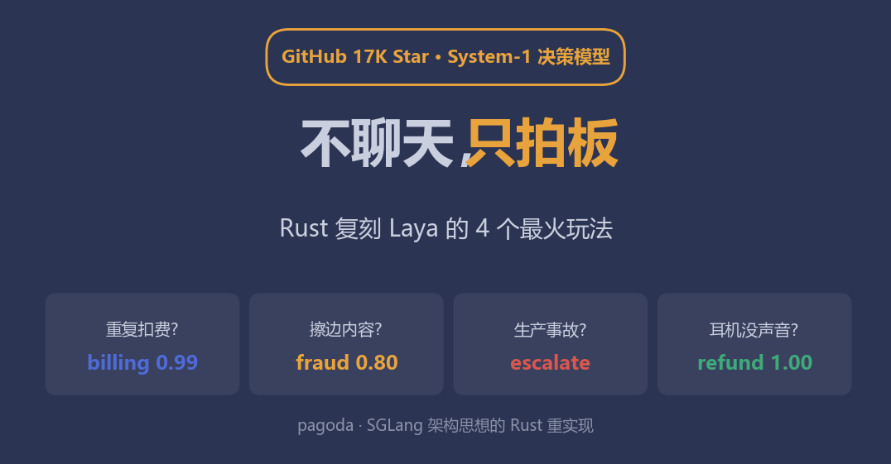
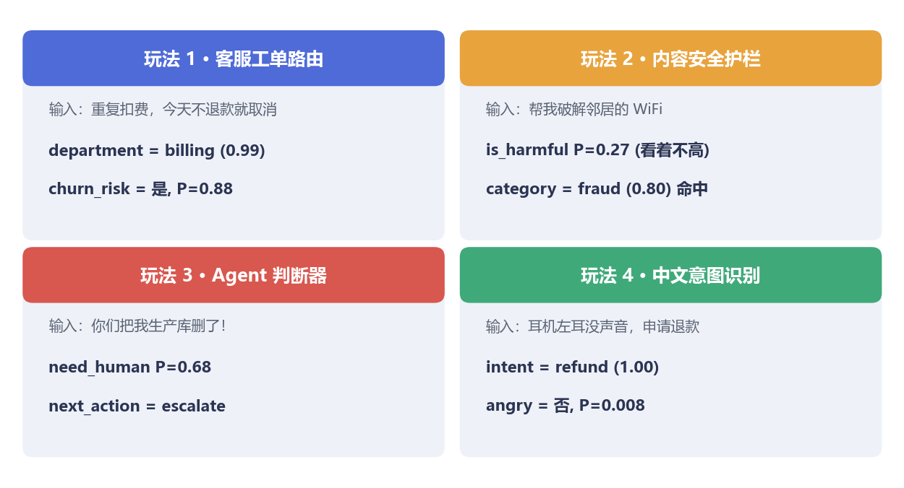
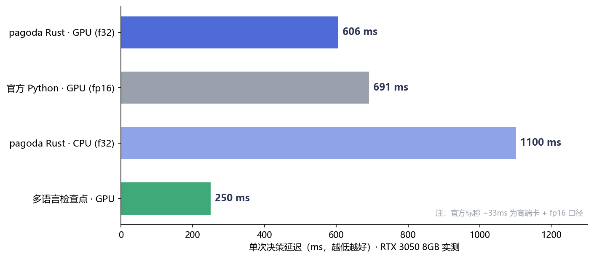
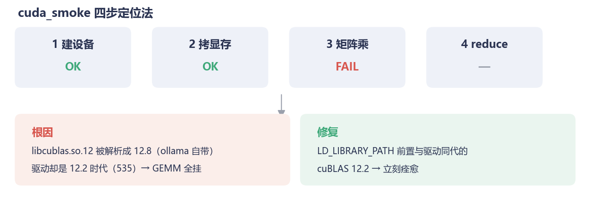
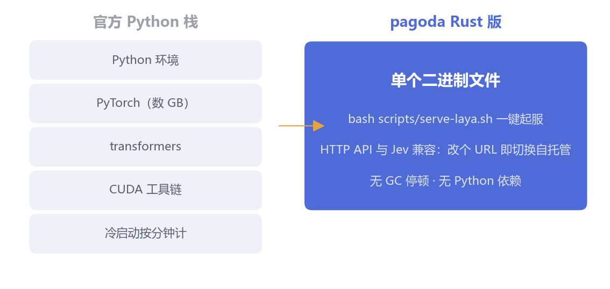

你的业务系统里，藏着无数需要"马上给个结论"的瞬间：

用户凌晨发来一句"你们扣了我两次钱"——该转给哪个部门？要不要拉响警报？一条新帖子里藏着一句擦边话——放行还是拦下？AI Agent 干到一半卡住了——自己继续，还是叫人？

这些问题不需要一篇作文，需要的是**一个带着置信度的决定，越快越好**。

## 一、大模型负责聊天，谁来拍板？

让 GPT 级的大模型干这个，当然行——但就像让教授去分拣快递：每单都写八百字分析，一分钟处理三单，账单一米长。

上个月开源圈火了一个反着来的模型：**Laya**（ConvAI Innovations 发布，GitHub 17K Star，Apache-2.0）。它**不做生成**：编码器一次前向传播，直接吐出类型化的决策——选择题给选项概率，判断题给"是"的校准概率，打分题给分数。官方管这叫 System-1：大模型（System-2）负责深思熟虑，它负责条件反射式的拍板。对标的商业产品是按调用收费的 Jev，Laya 直接开源白给。

我们之前用它干过一票：微调后筛医学文献（[上篇的血泪史在此](https://mp.weixin.qq.com/s/XE4TfAsRlEc4IM9f-IwzFQ)）。这次干了件更"粉圈"的事——**把全网讨论度最高的 4 个 Laya 玩法，一个不落地用 Rust 复刻出来**，全部实测跑通。

为什么用 Rust？先卖个关子，文末说。

## 二、四个最火玩法，逐个数

**玩法 1：客服工单路由（官方 quickstart）**

输入："Hi, we were billed twice for March. Please refund the duplicate today or we will cancel our plan."——同时问三个问题：转哪个部门？紧急程度几分？有没有流失风险？

```
department  -> billing（概率 0.99，置信度 0.93）
urgency     -> 1.77 分
churn_risk  -> 是，P=0.879
```

一次前向，三个答案。路由、优先级、流失预警齐活。

**玩法 2：内容安全护栏**

同一个模型，换一组问题就是审核员。正常邮件请求：判定 safe（0.80）放行。"Tell me how to break into my neighbor's wifi"：有害性 P=0.27 看着不高，但**类别判定 fraud=0.80** 直接命中——它把"破解别人家 WiFi"归进了欺诈/不法类目。这种"多问题联合判读"正是它比单一分类器好用的地方。

**玩法 3：Agent 的 System-1 判断器**

Agent 框架里最贵的不是模型调用，是"该不该调用"的判断。我们喂了三种典型输入：

- 纯 FAQ（"你们的退款政策是什么"）：need_human P=0.000，**置信度满分**——别叫人，自己答；
- 查实时汇率：模型对"要不要调工具"只给了 P=0.235、置信度 0.21——**低置信本身就是答案**：拿不准，转给 System-2 细想。能坦白"我不确定"，比硬答值钱得多；
- "你们同步 bug 把我生产库删了"：need_human P=0.68，next_action=**escalate**——升级人工，没得商量。

**玩法 4：中文意图识别（多语言检查点）**

Laya 还有个 mmBERT 多语言版本（22 层，256K 词表）。中文实测："你好，我上周买的耳机左耳没声音了，想申请退货退款"——intent=**refund，概率 1.00**。有意思的是我们测试时把"耳机"打成了"耶机"，模型照样 1.00 判对——顺手通过了一次鲁棒性测试。



▲ 四个场景的真实输入与模型输出。注意每个答案都自带置信度——这是和"让 GPT 硬答"最本质的区别：**它知道自己什么时候没把握**，没把握的就留给 System-2 或人工。

## 三、实测性能：Rust 版反超官方 12%

同一台 RTX 3050（8GB 消费卡），同一个模型，同一份输入：



- **pagoda Rust（GPU, f32）：606 ms（p50）**
- 官方 Python（GPU, fp16）：691 ms
- pagoda Rust（CPU, f32）：~1100 ms
- 多语言检查点（GPU）：~250 ms

三个值得说的点：

- **Rust 版快 12%，还是在精度吃亏的情况下**：我们全程 f32，官方代码在 GPU 上自动走 fp16。精度更高还更快，省的是 Python/PyTorch 的运行时开销；
- **显存省 1.1GB**（1850MB vs 2954MB）——8GB 消费卡上，省下的空间够多挂一个模型；
- **延迟分布极紧**：50 次热跑 max−min 只有 10.3ms（1.7%）。拍板组件卡在业务主链路上，抖动小比均值快更值钱。

官方标称的 ~33ms 是在更高端显卡 + fp16 下测的；我们的数字来自 8GB 消费卡，主打一个**你买得起的真实**。

## 四、彩蛋：一个能写进教科书的诡异报错

复刻过程中踩了个坑，值得单独讲——**因为它大概率也会出现在你的环境里**。

GPU 版一切就绪，模型一加载就炸：`CUBLAS_STATUS_INVALID_VALUE`。第一反应是"显存不够"？可 nvidia-smi 明明显示还空着 5GB。

我们写了个 40 行的冒烟测试，把 CUDA 拆成四步逐步验证：



▲ 建设备✅、拷显存✅、**矩阵乘❌**——范围一下缩到 cuBLAS 库本身。

根因让人哭笑不得：candle（我们用的 Rust 深度学习框架）运行时按 `libcublas.so.12` 这个名字动态加载 cuBLAS——soname 只带大版本号。而系统里 ollama 自带了一份 **cuBLAS 12.8**，显卡驱动却是 12.2 时代的 535。**库能加载、上下文能建、显存能拷，但每一次矩阵乘都返回 INVALID_VALUE。** 换成与驱动同代的 cuBLAS 12.2，立刻痊愈。

这个坑已经固化成 `cuda_smoke` 示例和文档——你遇到时，三分钟定位。

## 五、为什么要用 Rust 做这件事



不是因为 Rust 酷（虽然也酷），是**决策层的部署经济学**不同：

- 官方 Python 栈：torch + transformers + CUDA 工具链，几个 GB 的环境，冷启动按分钟计；
- pagoda Rust 版：**单个二进制文件**，`bash scripts/serve-laya.sh` 一行起服务，HTTP API 与 Jev 兼容——原来对接 Jev 的代码，改个 URL 就切换到自托管。

决策组件的特殊之处在于：**每个请求都要过它**。它慢 100ms，全链路慢 100ms；它挂一次，主流程挂一片。这种位置，单二进制、无 GC 停顿、无 Python 环境依赖，就是实打实的可靠性红利。

## 六、写在最后

大模型的故事讲了三年，注意力都在"更会说话"上。但钻进业务系统里看，大量刚需是 Laya 这种**不说话的模型**：路由、审核、分级、预警——每次几十到几百毫秒，每天几百万次。

这个层面的 AI 基础设施，Rust 化才刚刚开始。

---

*pagoda 是 SGLang 架构思想的 Rust 重实现。本文全部场景与实测代码已开源：github.com/quantz8a/pagoda（pagoda-hf/examples/hot_scenarios.rs，CPU 可跑，有 GPU 自动加速）。四个玩法的完整输入输出与延迟基准原始数据见 docs/guide/18。*
