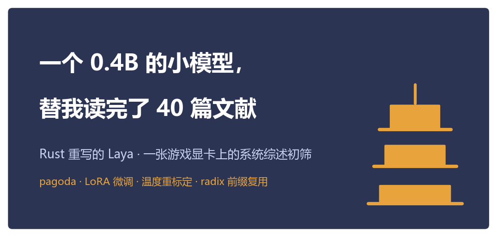
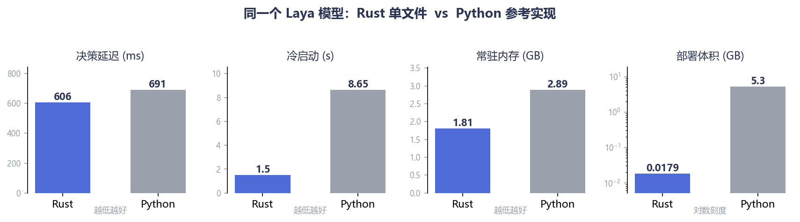
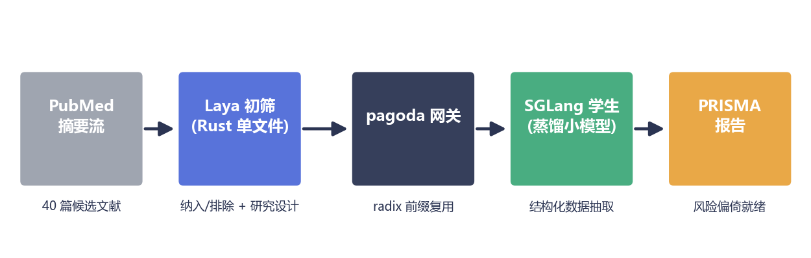
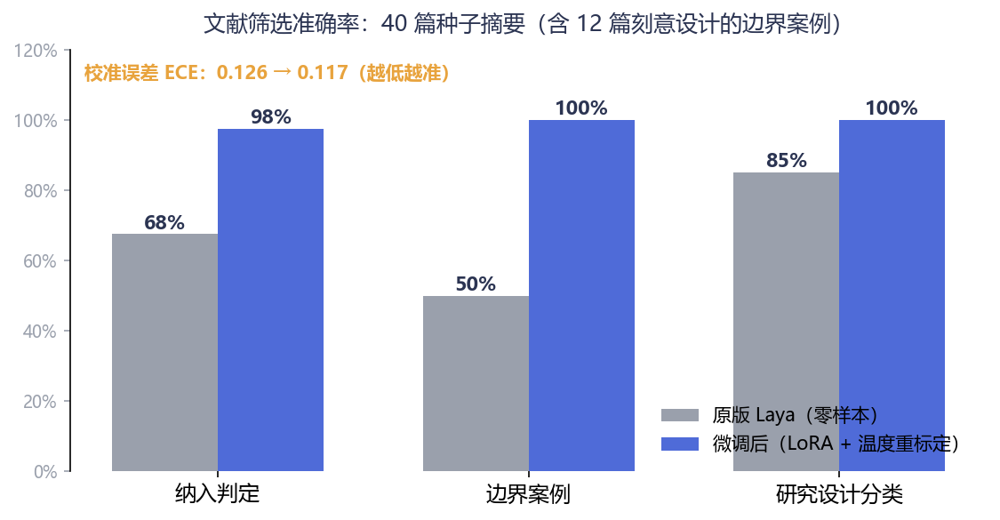
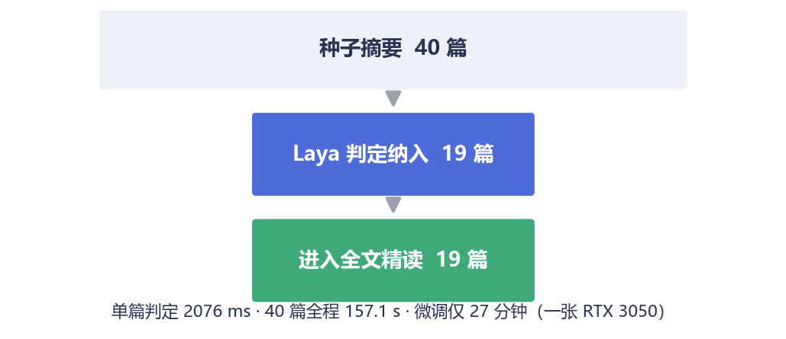

# 一个 0.4B 的小模型，替我读完了 40 篇文献

> Rust 重写的 Laya · 一张 RTX 3050 · 一次系统综述初筛的全流程实录



## 一、系统综述里最熬人的一步

做过 Meta 分析的朋友都知道，PRISMA 流程里最耗人的不是统计，而是**初筛**：

检索式往 PubMed 里一扔，哗啦啦回来几千篇摘要。方法学要求**两个人独立筛选**，一篇一篇点"纳入 / 排除"，意见不一致的还要拉第三个人仲裁。按一篇摘要 30 秒算，3000 篇就是两个人各 25 个小时——盯着标题摘要看到眼瞎的 25 个小时。

这个环节偏偏还最不能出错：漏纳一篇合格文献，整个综述的结论都可能被审稿人推翻。

那能不能让大模型来读？能，但直接上 GPT/Claude 有三个现实问题：

- **贵**：每篇摘要连提示词几千 token，几千篇就是一笔不小的 API 账单；
- **不稳**：自由文本输出，格式飘、难校验，凌晨三点跑批时它给你来一句"作为一个 AI 我不好判断"；
- **出不了内网**：医院、药厂的数据，根本不允许出门。

我们想要的其实是一个**只做判断题、不说废话的小模型**。最近我们把它折腾出来了——而且是纯 Rust 版。

## 二、Laya：不聊天的模型

[Laya](https://huggingface.co/convaiinnovations/laya) 是 Convo AI 开源的一个 0.4B"决策模型"。它不走"生成一段文字"那条路，而是把决策建模成**一组带类型的提问**：

```json
{
  "state": "Title: Aerobic exercise training and glycemic control...",
  "questions": {
    "include": { "type": "noul",
      "instructions": "该研究是否为符合 PICO 的随机对照试验……" },
    "design":  { "type": "choice",
      "instructions": "这项研究的设计类型是？",
      "criteria": { "rct": "随机对照试验", "cohort": "观察性队列", "…": "…" } }
  }
}
```

一次 `/decide` 调用，返回每个问题的**选项概率分布 + 置信度**：

```json
{ "answers": {
    "include": { "noul": 0.94,  "confidence": 0.91 },
    "design":  { "choice": "rct", "confidence": 0.88 } } }
```

`noul: 0.94` 读作"P(该研究符合纳入标准) = 0.94"——判定用阈值，仲裁用置信度，
低置信的篇目自动转人工，正好对上方法学里"分歧仲裁"那一环。

没有废话，没有格式漂移，概率可以直接进下游流水线。**不生成一个字，自然也没有 prefill/decode 的成本结构**——一次前向，两道题，完事。

## 三、为什么用 Rust 重写它

原版 Laya 是 Python 的：PyTorch + transformers，轻装上阵也要一个 5.3 GB 的虚拟环境。我们做 [pagoda](https://github.com/quantz8a/pagoda) 的初衷，是把 SGLang 那套服务化思想（radix 前缀缓存、结构化约束、持续批处理）用 Rust 重新实现一遍——Laya 顺手成了第一个"全家桶住户"。

同一张 RTX 3050 上的实测：



- **部署体积 17.9 MB 单二进制 vs 5.3 GB venv**（约 1/300），`scp` 过去就跑；
- **冷启动 1.4–1.6 s vs 7.9–9.4 s**——批处理脚本每分钟重启都不心疼；
- **单请求 606 ms vs 691 ms**——Rust 这边还是 f32 精度（Python 版用的是 fp16），精度吃亏依然快 12%；
- **峰值显存 1850 MB vs 2954 MB**，省 37%，给别的模型腾地方。

## 四、零样本的它，还差点火候

直接上岗之前，我们构造了一个真实任务当"入职考试"：

> **PICO**：成人 2 型糖尿病；结构化运动 vs 常规护理；结局指标 HbA1c；只纳入 RCT。

40 篇摘要当考题——14 篇标准 RCT（该收）、14 篇明显不相关（该拒），还有 **12 篇是刻意埋的"边界案例"**：混合了 1 型/2 型人群的、quasi-random 的、只发了会议摘要的、post-hoc 亚组分析的……这些正是真人筛选员也会吵起来的那类。

零样本的原版 Laya 成绩：**纳入判定 67.5%，边界案例只有 50%**——难的篇目约等于抛硬币，达不到"替人干活"的标准。（研究设计分类倒是不错，85%。）

## 五、半小时的入职培训：LoRA + 温度重标定

训练方案有意做得非常"轻"：

- **LoRA 只挂编码器的注意力/MLP**：7.2M 参数，占全模型 1.8%；
- **决策头全量训练**：26.2M 参数——它才是"判断"发生的地方；
- 两道题联合训练：纳入判定（noul）+ 研究设计五分类（choice）；
- 全程在**一张和别人共享的 RTX 3050** 上，batch=2、梯度检查点，显存占用 4 GB 出头。



训练之后还有一个关键小动作：**温度重标定**。Laya 输出的是概率，但"概率"不等于"靠谱程度"——神经网络出了名的自我感觉良好。我们在留出集上做网格搜索，给每类问题找最优温度系数，让"置信度 0.9"尽量真的意味着十次对九次。本例中标定把校准误差（ECE）从 0.154 压到 **0.117**——幅度不算惊人，但这个动作的意义在于：**流水线里每一环节的置信度，从此是可以拿来当阈值用的真概率**。

## 六、成绩单



| 指标 | 原版零样本 | 微调 + 标定后 |
| --- | --- | --- |
| 纳入判定（40 篇） | 67.5% | **97.5%** |
| 边界案例（12 篇） | 50.0% | **100%** |
| 研究设计分类 | 85.0% | **100%** |
| 校准误差 ECE（留出集） | 0.126 | **0.117** |

（诚实声明：40 篇中 34 篇参与过训练，这是"能否学会这套筛选标准"的能力验证；6 篇完全未见的留出集上趋势一致：边界案例 67%→100%，设计分类 83%→100%。）

训练耗时 **27 分钟**。换句话说：**一顿午饭的时间，把一个通用决策模型培训成了你这个课题的专科筛选员**——而且培训完直接导出成 Rust 单文件能加载的检查点（843 MB，含 tokenizer 与标定好的温度表），`--model-dir` 指过去就上线。



## 七、全景：一座跑在游戏本上的"文献工厂"

初筛只是第一道工序。完整的流水线长这样：

1. **Laya 初筛**（Rust 单文件，CPU 即可）：每篇摘要两道题（纳入？设计？），40 篇全程 157 秒；
2. **pagoda 网关**：通过初筛的 19 篇转发给下游做结构化抽取，全程分诊、路由、记账（`/stats` 里清清楚楚：61 次转发、2 次按科室路由）；
3. **SGLang 学生模型**（我们之前用蒸馏流水线训出的 1.5B 小模型）：逐篇抽取样本量、干预类型、HbA1c 变化，**19/19 输出合法 JSON**；
4. 一个诚实的观察：这批请求平均 11.5 秒里大头在 decode（每篇生成约 53 token），334 token 的 PICO 共享前缀就算被 radix 缓存完全命中，省下的 prefill 也只是零头——**前缀复用的红利属于"长提示、短输出"的负载，这次我们不是**。

还有个计划外的实战彩蛋：压测期间网关有 36 次调不通 Laya（CPU 被筛选流量打满），网关按设计 **fail-open** 放行并在 `/stats` 记账——一次故障演练都没专门做，生产细节自己冒出来了。

一个值得一提的细节：系统综述要求"双人独立筛选 + 分歧仲裁"。在我们的实现里，这被翻译成——**同一份权重，checkpoint 分叉出两个评审**（不同 LoRA / 不同温度），分歧的篇目自动路由给人工。方法学要求一字不改，成本从一整个人力变成一次前向。

## 八、收尾

整套东西都在 GitHub 上：**[github.com/quantz8a/pagoda](https://github.com/quantz8a/pagoda)**

- `pagoda-hf/`：Laya 的 Rust 推理 + 本文的筛选服务；
- `distill/train_laya.py`：30 分钟微调脚本（含温度重标定），换一批种子摘要就是你的课题；
- `docs/guide/`：从零开始的小白文档，一共 17 篇。

许可证是 Apache-2.0：随便用、随便改、可商用，唯一的要求是**保留版权声明**（NOTICE 文件里有完整的出处链）。我们的想法很简单：基础设施的价值在于被采用，而不是被锁起来。

下一篇我们聊聊：当初筛规模从 40 篇变成 4000 篇，radix 缓存和持续批处理能把账单压到多低。

---

*本文所有数字均来自 RTX 3050（8GB）上的真实测量，脚本与原始数据见仓库。*
